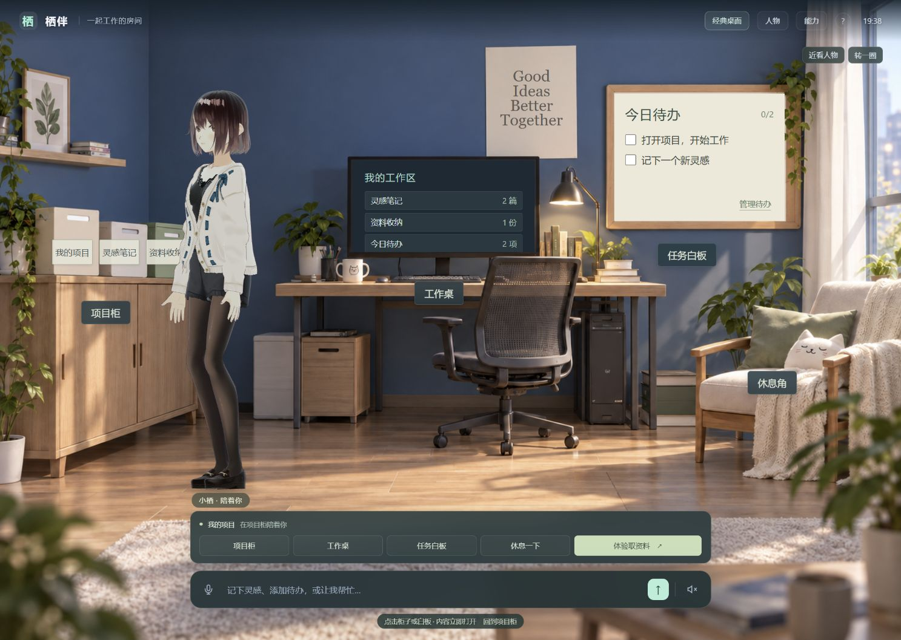
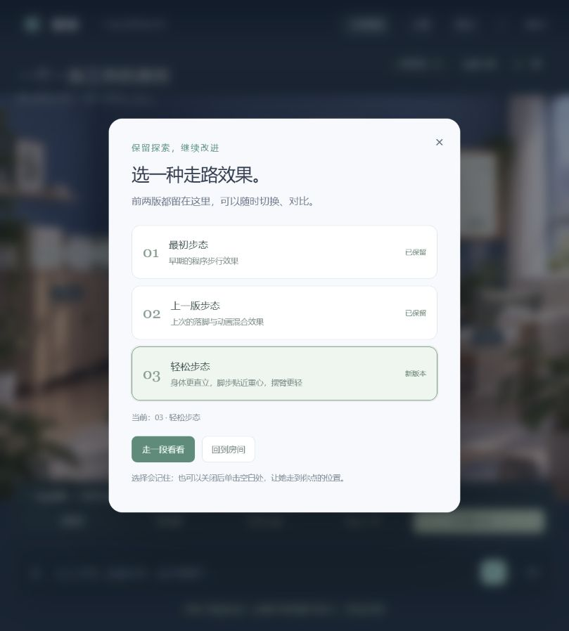

# 栖伴：能陪你做事的桌面伙伴

**项目仓库：`0920_codexgpt6_project` · 网页原型 v0.6**

栖伴探索的是一个问题：桌面上的 3D 人物，能否从“会动的装饰”变成理解工作空间、陪伴情绪、也能帮忙做事的伙伴？当前先用网页验证人物、场景、项目内容与动作之间的关系，再向真正的系统桌面扩展。

> 当前版本可以实际体验 3D 人物、两种场景、笔记／待办／文件和三版可切换走路效果。它尚未连接语言模型，也不会控制真实电脑桌面。

## 在线体验与效果

**[打开在线演示](https://yydshly.github.io/0920_codexgpt6_project/)** · [查看 GitHub 仓库](https://github.com/yydshly/0920_codexgpt6_project)。建议使用桌面浏览器打开；第一次载入 3D 模型需要一些时间。



工作室使用固定视角的房间背景与实时渲染的 VRM 人物。项目柜对应资料，工作桌对应笔记和文件，白板对应待办；内容先打开，人物再走向对应站位做动作。经典桌面保留可拖动的模拟图标和窗口，两种场景读取同一份数据。



建议按这条路径试用：

1. 点击右上角 **进入工作室**，再点项目柜、工作桌和任务白板，观察人物怎样回应真实内容。
2. 点击 **体验取资料**：人物从柜子取资料，携带走到工作桌并放下，最后走到白板旁。途中可停止或跳过动作。
3. 单击房间前景空白地面，让人物走到所点位置；再次单击可改变目的地。
4. 打开 **走路效果**，切换 **01 最初步态、02 上一版步态、03 轻松步态**，用“走一段看看”对比。两版旧效果保留供持续探索。
5. 在底部输入 `记下：今天想到一个点子`、`添加待办：检查人物动作`，再打开笔记和白板；也可导入 TXT／MD 文件，搜索并提取带原文行号的要点。
6. 点击 **人物**切换日常便装、温柔洋装、未来感三种形象，或临时导入自己的 VRM。

更多[工作室前后对照](companion-web/design-qa.md)、[三版步态说明](companion-web/motion-history/README.md)、[能力与验证记录](companion-web/VERIFICATION.md)都保留在仓库里。

## 我们的产品理解

单独把人物贴在壁纸上，动作很容易变成没有目的的游走。这里采用 **“空间对象 → 用户内容 → 人物行为”** 的关联：用户打开资料，人物去项目柜；写笔记，人物去工作桌；处理待办，人物去白板。走路是完成任务的过渡，而不是随机播放的特效。被点击的内容应立即可用，不必等人物走完。

网页阶段选用 **2.5D 工作室**：生成的房间图承载稳定、美观的空间氛围；真实 3D VRM 人物提供视线、表情、转身、动作和可比较的步态。固定前景通道与站位约束让人物和家具关系可信，也让日后替换为完整 3D 场景或透明桌面层时，内容与行为逻辑得以保留。经典桌面模式用来验证图标和文件交互，两种表现方式可以在页面上直接切换。

项目希望最终形成三层体验：

| 层次 | 想解决的问题 | 当前状态 |
| --- | --- | --- |
| 情感陪伴 | 形象、语音、视线和动作让陪伴自然、有节制 | 三款 VRM、基础手势和可选语音播报；情绪理解未接入 |
| 工作协助 | 人物能理解项目、文件和待办，并把行动表现出来 | 本地笔记、待办、文本导入、搜索、原文要点及工作室联动 |
| 真实桌面 | 在授权边界内操作真实窗口、文件和应用 | 仍是网页模拟；需要桌面适配器与明确的用户授权机制 |

后续方向是接入可审查的语言模型规划和工具调用、语音对话、可配置记忆，再把网页交互迁移为桌面应用。真实系统操作应逐步开放，并保留预览、撤销和权限边界。角色动作也将继续改进步伐、重心、手部接触和表情过渡。

## 当前已实现

- **场景与人物：** 经典桌面／工作室一键切换；三款内置 VRM 与临时自定义 VRM；眨眼、呼吸、视线、发丝、挥手、点头、伸懒腰、思考、拿取和放下。
- **移动与联动：** 单击空白处移动；工作室目标投影到前景通道；家具站位关联项目、笔记、文件和待办；途中改目标、停止、跳过及换场景均可取消旧动作。
- **动作实验：** 01 恢复早期程序步态、02 保留上一版脚步与动画混合、03 新增更直立轻松的步态；三版在页面内随时切换，选择持久保存。
- **实际可用的本地能力：** 笔记和待办增删改、TXT／MD 导入、全文搜索、带来源的要点提取、复合指令、撤销、图标拖放、可选语音输入与系统播报。
- **数据边界：** 内容保存在当前浏览器；页面没有后端与云同步，导入文件不会上传。语音输入是否可用及是否经过浏览器语音服务，取决于浏览器。

## 本地运行

需要 Node.js 18+，无需安装依赖，也不依赖运行时 CDN：

```bash
cd companion-web
npm start
```

然后打开 <http://127.0.0.1:5173/>。检查与测试：

```bash
cd companion-web
npm run check
npm test
```

本版验证记录为 **90 项测试通过**，覆盖内容能力、场景编排、步态、人物动作和动画采样；测试结果不代替主观的动作自然度评估。详细操作、指令示例和技术入口见 [网页原型说明](companion-web/README.md)。

## 仓库内容与研究样例

| 路径 | 内容 |
| --- | --- |
| [`companion-web/dist/`](companion-web/dist/) | 可直接托管的静态应用，包含三款人物、背景、道具、动画数据和本地渲染库 |
| [`companion-web/design-qa/`](companion-web/design-qa/) | 经典桌面、工作室、白板、取放资料和三版步态的效果截图 |
| [`companion-web/motion-history/`](companion-web/motion-history/) | 早期步态恢复件及上一版动作源码快照 |
| [`companion-web/tests/`](companion-web/tests/) | 交互、状态、动画和步态检查 |
| [`asset-research/`](asset-research/) | 模型、背景、动作素材的来源、分析脚本、研究记录与选型结论 |
| [`.github/workflows/pages.yml`](.github/workflows/pages.yml) | 推送主分支后验证并部署 GitHub Pages |

研究阶段下载的原始 VRM／GLB 与图片和演示程序内的资源重复，因此未重复提交；实际使用的三款 VRM、生成背景、文件夹道具和动画数据均已包含在 `companion-web/dist/assets/`。

## 授权与当前边界

角色素材的授权各不相同：**AvatarSample_A 非 CC0**，受 VRoid 示例模型使用条款约束；Victoria Rubin、Vita 与动作素材为 CC0。渲染库各有 MIT 许可。来源与具体限制见 [素材署名与许可](companion-web/dist/assets/ATTRIBUTION.txt)，发布或商用衍生版本前应分别核对。

当前工作室不是完整 3D 房间：家具来自固定视角背景，人物为实时 3D，前景通道用规则约束行走；不支持自由绕家具或物理抓取。指令由本地规则处理，要点是从原文抽取，尚非模型生成。这里的“桌面”是模拟界面，不是电脑系统桌面。
